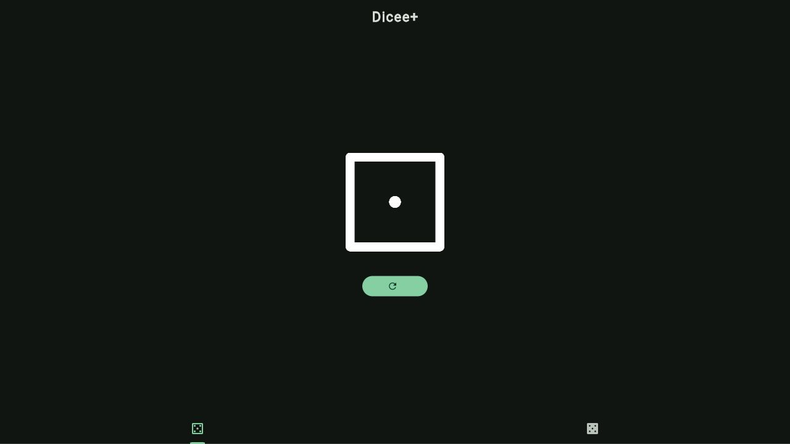

# Dicee+

Dicee+ is a Flutter application for rolling one or two dice. It provides two
tabs, animated die-face changes, and Material 3 light and dark themes.

## App preview

The one-die mode shown below lets the user roll a new value with the refresh
button. The second tab follows the same interaction for two dice.



## Features

- Roll a single die or a pair of dice.
- Animate each die-face change.
- Adapt dice assets and colours to the current light or dark theme.
- Run on the Flutter-supported mobile, desktop, and web platforms.

## Documentation

- [Architecture](docs/architecture.md): module boundaries, widget
  responsibilities, state, and assets.
- [Builds and local development](docs/builds.md): prerequisites, commands,
  quality checks, local runs, and platform builds.
- [Workflow](docs/workflow.md): required task workflow and dependency check.
- [Commit conventions](docs/commit-conventions.md): commit-message format and
  examples.
- [Documentation conventions](docs/documentation-conventions.md): language and
  maintenance rules for project documentation.

## Quick start

```bash
flutter pub get
flutter run
```

For the available targets and the full validation and build commands, see the
[builds and local development guide](docs/builds.md).
